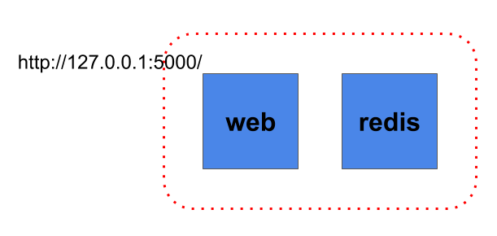
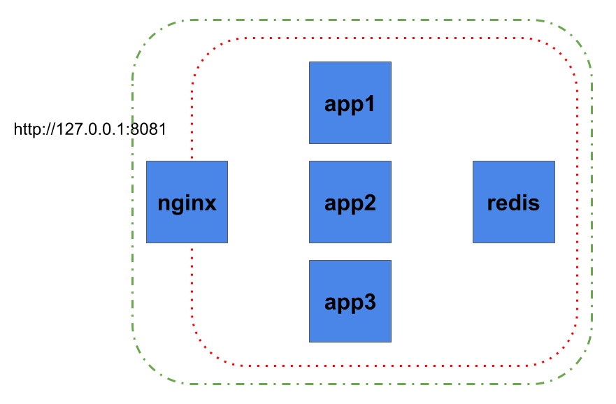

# Práctica de Docker

Vamos a conocer DOCKER; Docker permite empaquetar una aplicación con todas sus dependencias en una unidad estandarizada para el desarrollo de software. - https://www.docker.com/

Sigue las instrucciones paso a paso con la ayuda del instructor. Las prácticas de realizarán en una instancia Ubuntu de Vagrant.

## 0. Requisitos previos: Entorno local

* Instalar Docker - https://docs.docker.com/engine/installation/

* Abrir Git Bash (Windows) o Terminal (Linux/MacOSX)
* Usaremos el terminal 1 (T1) para monitorizar los containers y entorno.
* Usaremos el terminal 2 (T2) para trabajar con contenedores Docker.
* Iniciamos máquina virtual

```shell
T1$ vagrant up && vagrant ssh
T1$ watch docker ps -a

T2$ vagrant ssh
```

* Deberiamos obtener algo similar:


## 1. "hello world"

```shell
docker run hello-world
```

* ¿Que sucede?

## 2. Contenedores vs Imagenes

```shell
docker run -it alpine
  ls /
  hostname
  ps aux
  exit
docker images
```

* ¿Que sucede?

> Contenedor usado: https://hub.docker.com/_/alpine/

## 3. Interactuando con contenedores

```shell
c_id=$(docker run --name docker_example -itd alpine)
echo $c_id
docker attach docker_example
  hostname
```

* Apretamos CTRL+P & Q para volver a la VM de Vagrant
* ¿Que sucede?

```shell
docker inspect $c_id
docker inspect --format '{{.NetworkSettings.IPAddress}}' $c_id
docker_hostname=$(docker inspect --format '{{.HostnamePath}}' $c_id)
echo $docker_hostname
sudo more $docker_hostname
echo $c_id
docker stop $c_id
```

* ¿Que sucede?

## 4. Limpiar el entorno local

```shell
docker run --name docker_example -itd alpine
docker ps
docker ps -a
docker ps -aq
```

* ¿Que sucede?

```shell
docker rm $(docker ps -aq)
```

* ¿Que sucede?

## 5. Composición docker-compose.yml + Dockerfile

Compondremos un servidor de aplicaciones Python/Flask con una base de datos Redis.

* Preparación del entorno

```shell
docker pull redis:4.0
docker pull python:2.7
docker pull nginx:1.13
```

* La idea es hacer esta infraestructura de aplicaciones:



* El script de Docker Compose:

```shell
mkdir -p /vagrant/aitm-06_Docker/01 && cd /vagrant/aitm-06_Docker/01
vim docker-compose.yml
```

* Añadimos...

```yaml
#cat <<EOF | tee docker-compose.yml
version: '3'

services:

  web:
    build: .
    command: python app.py
    ports:
     - "5000:5000"
    volumes:
     - .:/code
    links:
     - redis

  redis:
    image: redis:4.0
#EOF
```

* Salvamos y salimos con *:x*
* El Dockerfile:

```shell
vim Dockerfile
```

* Añadimos...

```
#cat <<EOF | tee Dockerfile
FROM python:2.7
ADD . /code
WORKDIR /code
RUN pip install -r requirements.txt
#EOF
```

* Salvamos y salimos con *:x*
* Código Python sobre entorno de Flask con conexión a Redis:

```shell
vim app.py
```

* Añadimos...

```python
#cat <<EOF | tee app.py
from flask import Flask
from redis import Redis
import os
app = Flask(__name__)
redis = Redis(host='redis', port=6379)

@app.route('/')
def hello():
    redis.incr('hits')
    return 'Hello World! I have been seen %s times.' % redis.get('hits')

if __name__ == "__main__":
    app.run(host="0.0.0.0", debug=True)
#EOF
```

* Salvamos y salimos con *:x*
* Los requerimientos mínimos de Python

```shell
vim requirements.txt
```

* Añadimos...

```
#cat <<EOF | tee requirements.txt
Flask==0.12.2
redis==2.10.6
#EOF
```

* Salvamos y salimos con *:x*
* Ejecutamos la aplicación

```shell
docker-compose up -d
docker-compose ps
docker-compose logs
```

* ¿Que sucede?

```shell
curl 127.0.0.1:5000
```

* Abrimos un navegador y vamos a http://127.0.0.1:5000/
* ¿Que sucede?

```shell
docker-compose down
```

* ¿Que sucede?

## 6. Composiciones avanzadas de Docker

La idea es hacer esta infraestructura de aplicaciones:



* Configuración del balanceo con Nginx:

```shell
mkdir -p /vagrant/aitm-06_Docker/02 && cd /vagrant/aitm-06_Docker/02
vim nginx.conf
```

* Añadimos...

```
#cat <<EOF | tee nginx.conf
worker_processes 1;

events { worker_connections 1024; }

http {

    sendfile on;

    gzip              on;
    gzip_http_version 1.0;
    gzip_proxied      any;
    gzip_min_length   500;
    gzip_disable      "MSIE [1-6]\.";
    gzip_types        text/plain text/xml text/css
                      text/comma-separated-values
                      text/javascript
                      application/x-javascript
                      application/atom+xml;

    # List of application servers
    upstream app_servers {

        server app1:5000;
        server app2:5000;
        server app3:5000;

    }

    # Configuration for the server
    server {

        # Running port
        listen [::]:80;
        listen 80;

        # Proxying the connections connections
        location / {

            proxy_pass         http://app_servers;
            proxy_redirect     off;
            proxy_set_header   Host $host;
            proxy_set_header   X-Real-IP $remote_addr;
            proxy_set_header   X-Forwarded-For $proxy_add_x_forwarded_for;
            proxy_set_header   X-Forwarded-Host $server_name;
        }
    }
}
#EOF
```

* Salvamos y salimos con *:x*
* El script de Docker Compose para Tomcat con Nginx:

```shell
vim docker-compose.yml
```

* Añadimos...

```yaml
#cat <<EOF | tee docker-compose.yml
version: '3'

volumes:
  redis_data:

services:

  nginx:
    image: nginx:1.13
    restart: always
    ports:
      - "80:80"
    volumes:
      - ./nginx.conf:/etc/nginx/nginx.conf

  app1:
    build: .
    restart: always
    command: python app.py
    expose:
      - "5000"
    volumes:
      - .:/code

  app2:
    image: 02_app1
    restart: always
    command: python app.py
    expose:
      - "5000"
    volumes:
      - .:/code

  app3:
    image: 02_app1
    restart: always
    command: python app.py
    expose:
      - "5000"
    volumes:
      - .:/code

  redis:
    image: redis:4.0
    expose:
      - "6379"
    volumes:
      - "redis_data:/data"
#EOF
```

* Salvamos y salimos con *:x*
* El Dockerfile:

```shell
vim Dockerfile
```

* Añadimos...

```shell
#cat <<EOF | tee Dockerfile
FROM python:2.7
ADD . /code
WORKDIR /code
RUN pip install -r requirements.txt
#EOF
```

* Salvamos y salimos con *:x*
* Código Python sobre entorno de Flask con conexión a Redis:

```shell
vim app.py
```

* Añadimos...

```python
#cat <<EOF | tee app.py
from flask import Flask
from redis import Redis
import os, socket

app = Flask(__name__)
redis = Redis(host='redis', port=6379)

@app.route('/')
def hello():
    redis.incr('hits')
    return 'Hello World! I have been seen '+ str(redis.get('hits')) +' times from '+ str(socket.gethostname())

if __name__ == "__main__":
    app.run(host="0.0.0.0", debug=True)
#EOF
```

* Salvamos y salimos con *:x*
* Los requerimientos mínimos de Python

```shell
vim requirements.txt
```

* Añadimos...

```
#cat <<EOF | tee requirements.txt
Flask==0.12.2
redis==2.10.6
#EOF
```

## 7. Pasamos a la acción

>> ¿Es necesario limpiar el entorno?
>> docker network prune -f ; docker volume prune -f

* Ejecutamos...

```shell
docker-compose up -d --force-recreate
docker-compose ps
docker network ls
docker volume ls
docker logs -f
```

* ¿Que sucede?
* Ejecutamos...

```shell
curl http://127.0.0.1/
```

* Abrimos un navegador y vamos a http://127.0.0.1:8081/
* ¿Que sucede?

# 8. Limpiamos en entorno

```
docker-compose stop
docker-compose rm
```

* ¿Que sucede?

# 9. Eliminamos las instancias Vagrant

```
exit
vagrant destroy -f
```

---

# Comandos útiles

* Añadir en ` ~/.bashrc`

```shell
alias my_dock_kill_rm='docker kill $(docker ps -aq) ; docker rm $(docker ps -aq)'
alias my_dock_rmi_all='docker rmi -f $(docker images -aq)'
my_dock_teardown() { docker kill $(docker ps -aq) ; docker rm $(docker ps -aq) ; docker rmi -f $(docker images -aq) ; docker volume prune -f ; docker network prune -f ; }
my_dock_in() { docker exec -it $1 sh ; }
```

---

Creado por [carlessanagustin.com](http://www.carlessanagustin.com)
