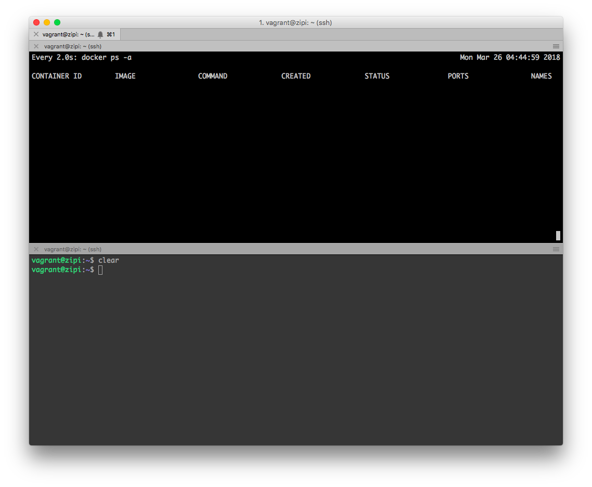

# Práctica de Docker

Vamos a conocer DOCKER; Docker permite empaquetar una aplicación con todas sus dependencias en una unidad estandarizada para el desarrollo de software. - https://www.docker.com/

Sigue las instrucciones paso a paso con la ayuda del instructor. Las prácticas de realizarán en una instancia Ubuntu de Vagrant.

## Requisitos previos: Entorno local

* Instalar Docker - https://docs.docker.com/engine/installation/

* Abrir Git Bash (Windows) o Terminal (Linux/MacOSX)
* Iniciamos máquina virtual:

```shell
vagrant up zipi
vagrant ssh zipi
```

* Abrimos otro terminal siguiendo los pasos anteriores hasta obtener algo similar:



* Usaremos el terminal 1 para trabajar con contenedores Docker.
* Usaremos el terminal 2 (T2) para monitorizar los containers con los comandos siguientes:

```shell
T2$ docker ps
T2$ docker ps -a
```

## "hello world"

```shell
sudo docker run hello-world
```

* ¿Que sucede?

```shell
$ docker run -it busybox
$ ls
$ hostname
$ ps aux
T2$ docker ps
T2$ docker ps -a
$ exit
```

* ¿Que sucede?
* Contenedor usado: https://hub.docker.com/_/busybox/

## Trabajando con contenedores

```shell
$ c_id=$(docker run --name docker_example -itd busybox)
$ echo $c_id
T2$ docker ps
$ docker attach docker_example
$ hostname
```

* Apretamos CTRL+P+Q para volver a la VM de Vagrant (tarda un poco)

```shell
T2$ docker ps
```

* ¿Que sucede?

```shell
docker inspect $c_id
docker inspect --format '{{.NetworkSettings.IPAddress}}' $c_id
docker_hostname=$(docker inspect --format '{{.HostnamePath}}' $c_id)
echo $docker_hostname
sudo more $docker_folder
echo $c_id
docker stop $c_id
```

* ¿Que sucede?

## Limpieza de contenedores

```shell
T2$ docker ps -a
T2$ docker ps -aq
```

* ¿Que sucede?

```shell
docker rm $(docker ps -aq)
```

* ¿Que sucede?

## Composiciones Docker

Compondremos un servidor de aplicaciones Python/Flask con una base de datos Redis.

### Preparación del entorno (ya realizado por el instructor)

```shell
docker pull redis
docker pull python:2.7
```

## Ficheros de configuración

* El script de Docker Compose:

```shell
cd /carpeta/de/trabajo/
vim docker-compose.yml
```

* Añadimos...

```yaml
web:
  build: .
  command: python app.py
  ports:
   - "5000:5000"
  volumes:
   - .:/code
  links:
   - redis
redis:
  image: redis
```

* Salvamos y salimos con *:x*
* El Dockerfile:

```shell
$ vim Dockerfile
```

* Añadimos...

```
FROM python:2.7
ADD . /code
WORKDIR /code
RUN pip install -r requirements.txt
```

* Salvamos y salimos con *:x*
* Código Python sobre entorno de Flask con conexión a Redis:

```shell
vim app.py
```

* Añadimos...

```python
from flask import Flask
from redis import Redis
import os
app = Flask(__name__)
redis = Redis(host='redis', port=6379)

@app.route('/')
def hello():
    redis.incr('hits')
    return 'Hello World! I have been seen %s times.' % redis.get('hits')

if __name__ == "__main__":
    app.run(host="0.0.0.0", debug=True)
```

* Salvamos y salimos con *:x*
* Los requerimientos mínimos de Python

```shell
vim requirements.txt
```

* Añadimos...

```
flask
redis
```

* Salvamos y salimos con *:x*

## Pasamos a la acción

* Ejecutamos...

```shell
$ docker-compose up -d
T2$ cd /carpeta/de/trabajo/
T2$ docker-compose ps
T2$ docker-compose logs
$ curl localhost:5000
```

* ¿Que sucede?
* Abrimos un navegador y vamos a http://IP_publica_de_la_vm_de_vagrant:5000/
* ¿Que sucede?

```shell
docker-compose stop
```

* ¿Que sucede?

## Composiciones avanzadas de Docker

Compondremos varios servidores de aplicación Tomcat con balanceador de carga Nginx.

### Preparación del entorno (ya realizado por el instructor)

```shell
docker pull tomcat
docker pull nginx
```

## Ficheros de configuración

* Configuración del balanceo con Nginx:

```shell
vim nginx.conf
```

* Añadimos...

```
worker_processes 1;

events { worker_connections 1024; }

http {

    sendfile on;

    gzip              on;
    gzip_http_version 1.0;
    gzip_proxied      any;
    gzip_min_length   500;
    gzip_disable      "MSIE [1-6]\.";
    gzip_types        text/plain text/xml text/css
                      text/comma-separated-values
                      text/javascript
                      application/x-javascript
                      application/atom+xml;

    # List of application servers
    upstream app_servers {

        server tomcatapp1:8080;
        server tomcatapp2:8080;
        server tomcatapp3:8080;

    }

    # Configuration for the server
    server {

        # Running port
        listen [::]:80;
        listen 80;

        # Proxying the connections connections
        location / {

            proxy_pass         http://app_servers;
            proxy_redirect     off;
            proxy_set_header   Host $host;
            proxy_set_header   X-Real-IP $remote_addr;
            proxy_set_header   X-Forwarded-For $proxy_add_x_forwarded_for;
            proxy_set_header   X-Forwarded-Host $server_name;
        }
    }
}
```

* Salvamos y salimos con *:x*
* El script de Docker Compose para Tomcat con Nginx:

```shell
vim compose-tomcat.yml
```

* Añadimos...

```
nginx:
  image: nginx
  links:
   - tomcatapp1:tomcatapp1
   - tomcatapp2:tomcatapp2
   - tomcatapp3:tomcatapp3
  ports:
   - "80:80"
  volumes:
   - nginx.conf:/etc/nginx/nginx.conf
tomcatapp1:
  image: tomcat
  volumes:
   - sample.war:/usr/local/tomcat/webapps/sample.war
tomcatapp2:
  image: tomcat
  volumes:
   - sample.war:/usr/local/tomcat/webapps/sample.war
tomcatapp3:
  image: tomcat
  volumes:
   - sample.war:/usr/local/tomcat/webapps/sample.war
```

* Salvamos y salimos con *:x*
* Descargamos el fichero WAR de muestra

```shell
wget https://github.com/carlessanagustin/DockerDo/raw/master/08_Compose/sample.war
```

## Pasamos a la acción

* Ejecutamos...

```shell
$ docker-compose up -d -f compose-tomcat.yml
T2$ docker-compose ps
$ docker exec composetest_nginx_1 cat /etc/hosts
$ docker exec composetest_tomcatapp1_1 ip a
$ docker exec composetest_tomcatapp2_1 ip a
$ docker exec composetest_tomcatapp3_1 ip a
$ curl http://localhost/sample/
```

* ¿Que sucede?

# Limpiamos en entorno

```
docker-compose stop
docker-compose rm
```

# Eliminamos las instancias Vagrant

```
vagrant destroy -f
```

---

Creado por [carlessanagustin.com](http://www.carlessanagustin.com)
