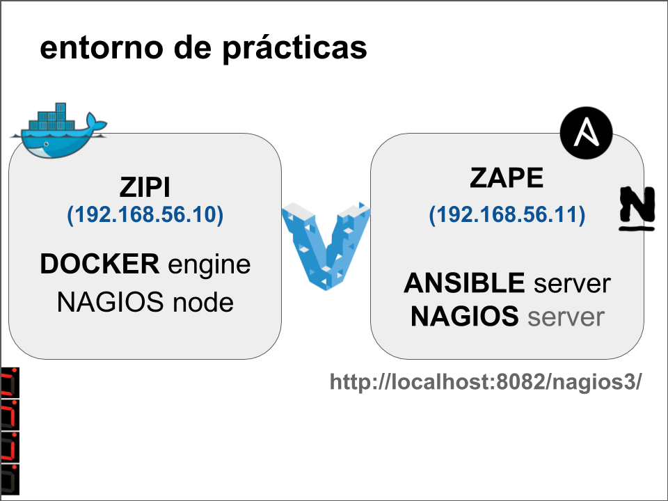

# Curso práctico de herramientas DevOps.

Este curso incluye prácticas de iniciación a los siguientes softwares:

* [Git](01_Git)
* [Vagrant](02_Vagrant)
* ~~[Jenkins](03_Jenkins)~~ (DEPRECATED)
* [Ansible](04_Ansible)
* [Nagios](05_Nagios)
* [Docker](06_Docker)

## Requisitos previos

Para las prácticas es necesario de algunos requisitos prévios que se encuentran [aquí](pre-requisitos)

* Presentacion: [Presentacion](./slides/slides-AITM-2018.pdf)

## Infraestructura

Esta es la infraestructura de practicas diseñada:

---

Creado por [carlessanagustin.com](http://www.carlessanagustin.com)
