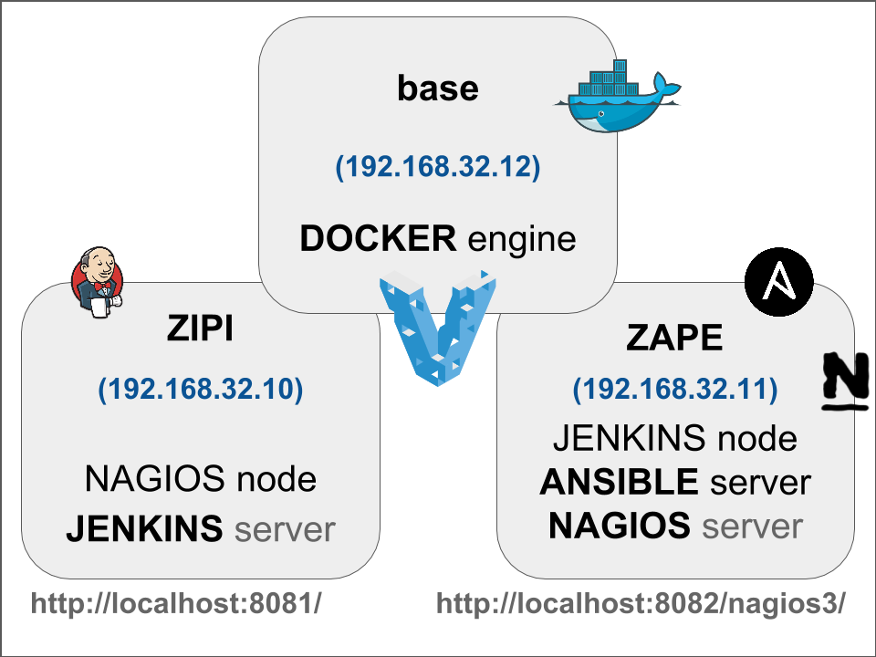

# Pre requisitos necesarios para las prácticas

Esta carpeta contiene los ficheros necesarios para generar los entornos de prácticas. El entorno de pruebas esta compuesto de tres máquinas virtuales como se muestra en el siguiente diagrama:



### Software necesario

* Instalar VirtualBox - https://www.virtualbox.org/
* Instalar Vagrant - https://www.vagrantup.com/
* Instalar Git - https://git-scm.com/


## Opción 1: Entornos pre-generados

El profesor ya se ha encargado de actualizar y aprovisionar las máquinas virtuales. Este os proveerá de varios ficheros .box que deben ser copiados en la carpeta de inicio del usuario.

* Abrir Git Bash (Windows) o Terminal (Linux/MacOSX)

```
$ mkdir working
$ cd working
$ vagrant box add zipi ../ubuntu-trusty-64-zipi.box
$ vagrant box add zape ../ubuntu-trusty-64-zape.box
$ vagrant box add base ../ubuntu-trusty-64-base.box
```

* Iniciar las máquinas virtuales

```
$ vagrant up
```

## Opción 2: Generación de los entornos

* Para generar de nuevo este entorno solo debemos hacer:

```
$ cd pre-pre-requisitos
$ vagrant up --provision
```

* Una vez ya esten listas las máquinas virtuales, las podemos cerrar y exportar:

```
$ vagrant halt
$ vagrant package --output ../ubuntu-trusty-64-zipi.box zipi
$ vagrant package --output ../ubuntu-trusty-64-zape.box zape
$ vagrant package --output ../ubuntu-trusty-64-base.box base
```

Creado por [carlessanagustin.com](http://www.carlessanagustin.com)