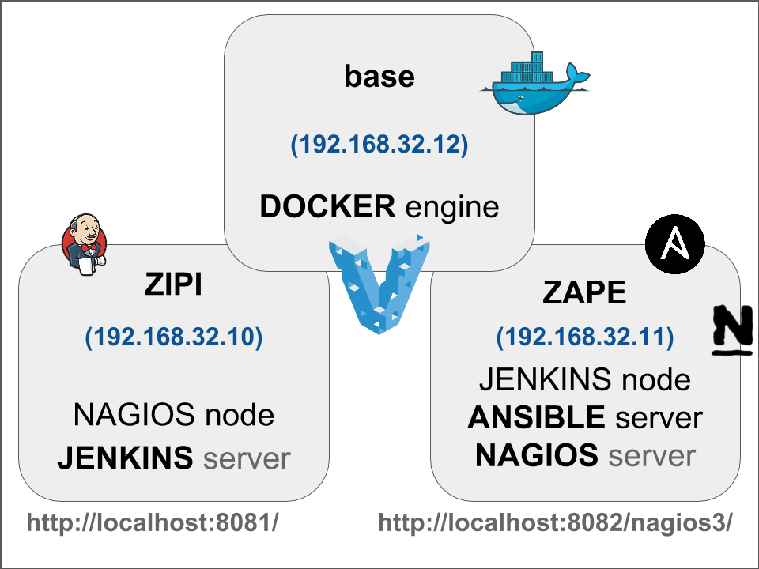

# Pre requisitos necesarios para las prácticas

Esta carpeta contiene los ficheros necesarios para generar los entornos de prácticas. El entorno de pruebas esta compuesto de tres máquinas virtuales como se muestra en el siguiente diagrama:



### Software necesario

* Instalar VirtualBox - https://www.virtualbox.org/
* Instalar Vagrant - https://www.vagrantup.com/
* Instalar Git - https://git-scm.com/


## Opción 1: Entornos pre-generados

El profesor ya se ha encargado de actualizar y aprovisionar las máquinas virtuales. Este os proveerá de varios ficheros .box que deben ser copiados en la carpeta de inicio del usuario.

* Abrir Git Bash (Windows) o Terminal (Linux/MacOSX)

```
mkdir working
cd working
vagrant box add zipi ../ubuntu-trusty-64-zipi.box
vagrant box add zape ../ubuntu-trusty-64-zape.box
vagrant box add base ../ubuntu-trusty-64-base.box
```

* Iniciar las máquinas virtuales

```
vagrant up
```

## Opción 2: Generación de los entornos

* Para generar los entornos debemos crear la imagen base:

```
cd pre-pre-requisitos
vagrant up base --provision
vagrant halt
vagrant package --output ../../ubuntu-trusty-64-base.box base
vagrant box add base ../../ubuntu-trusty-64-base.box
```

* Una vez creada la 1a màquina virtual base, pasamos a crear los entornos de trabajo:

```
vagrant up zipi zape --provision
```

* Una vez creados, podemos pasar a exportar los ficheros box:

```
vagrant halt
vagrant package --output ../../ubuntu-trusty-64-zipi.box zipi
vagrant package --output ../../ubuntu-trusty-64-zape.box zape
```

# Acceso a Jenkins

Podemos encontrar la contraseña del usuario *admin* en:

```
more /var/lib/jenkins/secrets/initialAdminPassword
```

---

Creado por [carlessanagustin.com](http://www.carlessanagustin.com)
